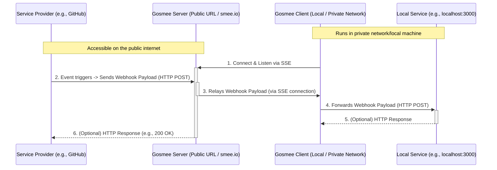

# 🔄 gosmee - A webhook forwarder/relayer and replayer

<p align="center">

</p>

✨ Gosmee is a powerful webhook relayer that runs anywhere with ease!
📡 It also serves as a GitHub Hooks replayer using the GitHub API.

## 📝 Description

Gosmee enables you to relay webhooks from itself (as a server) or from
<https://smee.io> to your local laptop or infrastructure hidden from the public
internet.

It makes exposing services on your local network (like localhost) or behind
a VPN simple and secure. This allows public services, such as GitHub, to push
webhooks directly to your local environment.

Here's how it works:

1. Configure your Webhook to send events to a <https://smee.io/> URL or to
   your publicly accessible Gosmee server.
2. Run the Gosmee client on your local machine to fetch these events and
   forward them to your local service.

This creates a seamless bridge between GitHub webhooks and your local
development environment!

Alternatively, if you prefer not to use a relay server, you can use the
GitHub API to replay webhook deliveries.

### Diagram

For those who prefer a visual explanation of how gosmee works:

#### Simple


#### Detailed



## Blog Post

Learn more about the background and features of this project in this blog
post: <https://blog.chmouel.com/posts/gosmee-webhook-forwarder-relayer>

## 🖥️ Screenshot


### Live Event Feed

The web interface of the gosmee server features a live event feed that shows webhook events in real-time:

- 🔴 Live status indicator showing connection state
- Event counter showing number of received events
- JSON tree viewer for easy payload inspection
- Copy buttons for headers and payloads
- 🔄 Replay functionality to resend events to your endpoint
- Clear button to remove all events from the feed

Each event in the feed shows:

- Event ID and timestamp
- Headers with copy functionality
- Payload in both tree view and raw JSON formats
- Option to replay individual events

## 🛠️ Replay Viewer Utility

Gosmee includes a helper script [`misc/replayview`](./misc/replayview) for
interactively browsing, previewing, and replaying webhook events saved by the
client (`--saveDir`). This tool lets you:

- Fuzzy-find replay shell scripts and their JSON payloads
- Preview event metadata, headers, and payloads
- Copy replay script paths to clipboard
- Create symlinks for quick access
- Run replay scripts directly
- Interactively inspect JSON payloads (requires [`fx`](https://github.com/antonmedv/fx))

**Usage:**

```sh
./misc/replayview -h
```

By default, it looks for replay files in `/tmp/save` or `/tmp/replay`. Use `-d
<dir>` to specify a different directory.

**Requirements:** `fzf`, `jq`, `fd`, and optionally `fx` for interactive JSON
viewing.

See the script header or run with `-h` for full options and details.

## 📥 Install

### Release

Go to the [release](https://github.com/chmouel/gosmee/releases) page and
choose the appropriate archive or package for your platform.

## 🍺 Homebrew

```shell
brew tap chmouel/gosmee https://github.com/chmouel/gosmee
brew install gosmee
```

## [Arch](https://aur.archlinux.org/packages/gosmee-bin)

```shell
yay -S gosmee-bin
```

### 🐳 Docker

#### Gosmee client with Docker

```shell
docker run ghcr.io/chmouel/gosmee:latest
```

#### Gosmee server with Docker

```shell
docker run -d -p 3026:3026 --restart always --name example.org ghcr.io/chmouel/gosmee:latest server --port 3026 --address 0.0.0.0 --public-url https://example.org
```

### GO

```shell
go install -v github.com/chmouel/gosmee@latest
```

### 📂 Git

Clone the repository and use:

```shell
-$ make build
-$ ./bin/gosmee --help
```

### ❄️ [Nix/NixOS](https://nixos.org/)

Gosmee is available from [`nixpkgs`](https://github.com/NixOS/nixpkgs).

```shell
nix-env -iA gosmee
nix run nixpkgs#gosmee -- --help # your args are here
```

### System Services

System Service example files for macOS and Linux are available in the
[misc](./misc) directory.

### ☸️ Kubernetes

You can deploy gosmee on Kubernetes to relay webhooks to your internal services.

Two deployment yaml are available:

- [gosmee-server-deployment.yaml](./misc/gosmee-server-deployment.yaml) - For deploying the public-facing server component
- [gosmee-client-deployment.yaml](./misc/gosmee-client-deployment.yaml) - For deploying the client component that forwards to internal services

#### Server Deployment

The server deployment exposes a public webhook endpoint to receive incoming webhook events:

```shell
kubectl apply -f misc/gosmee-server-deployment.yaml
```

Key configuration:

- Set `--public-url` to your actual domain where the service will be exposed
- Configure an Ingress with TLS or use a service mesh for production use
- For security, consider using `--webhook-signature` and `--allowed-ips` options

#### Client Deployment

The client deployment connects to a gosmee server (either your own or smee.io) and forwards webhook events to internal services:

```shell
kubectl apply -f misc/gosmee-client-deployment.yaml
```

Key configuration:

- Adjust the first argument to your gosmee server URL or smee.io channel
- Change the second argument to your internal service URL (e.g., `http://service.namespace:8080`)
- The `--saveDir` flag enables saving webhook payloads to `/tmp/save` for later inspection

For detailed configuration options, refer to the documentation comments in each deployment file.

### Shell completion

Shell completions are available for gosmee:

```shell
# BASH
source <(gosmee completion bash)

# ZSH
source <(gosmee completion zsh)
```

## 🚀 Usage

### 💻 Client

If you plan to use <https://smee.io>, you can generate your own smee URL by
visiting <https://smee.io/new>.

If you want to use <https://hook.pipelinesascode.com> then you can directly
generate a URL with  the `-u / --new-url` flag to generate one.

Once you have it, the basic usage is:

```shell
gosmee client https://smee.io/aBcDeF https://localhost:8080
```

This command will relay all payloads received by the smee URL to a service
running on <http://localhost:8080>.

You can also save all relays as shell scripts for easy replay:

```shell
gosmee client --saveDir /tmp/savedreplay https://smee.io/aBcDeF https://localhost:8080
```

This command saves the JSON data of new payloads to
`/tmp/savedreplay/timestamp.json` and creates shell scripts with cURL options
at `/tmp/savedreplay/timestamp.sh`. Replay webhooks easily by running these
scripts!

You can ignore certain events (identified by GitLab/GitHub/Bitbucket) with one or more `--ignore-event` flags.

If you only want to save payloads without replaying them, use `--noReplay`.

By default, you'll get colorful output unless you specify `--nocolor`.

Output logs as JSON with `--output json` (which implies `--nocolor`).

### 🖥️ Server

With `gosmee server` you can run your own relay server instead of using
<https://smee.io>.

By default, `gosmee server` binds to `localhost` on port `3333`. For practical
use, you'll want to expose it to your public IP or behind a proxy using the
`--address` and `--port` flags.

For security, you can use Let's Encrypt certificates with the `--tls-cert`
and `--tls-key` flags.

There are many customization options available - check them with `gosmee server
--help`.

To use your server, access it with a URL format like:

<https://myserverurl/RANDOM_ID>

The random ID must be 12 characters long with characters from `a-zA-Z0-9_-`.

Generate a random ID easily with the `/new` endpoint:

```shell
% curl http://localhost:3333/new
http://localhost:3333/NqybHcEi
```

#### Caddy

[Caddy](https://caddyserver.com/) is the ideal way to run gosmee server:

```caddyfile
https://webhook.mydomain {
    reverse_proxy http://127.0.0.1:3333 {
        header_up X-Real-IP {remote_host}
        header_up X-Forwarded-For {remote_host}
    }
}
```

It automatically configures Let's Encrypt certificates for you!

#### Nginx

Running gosmee server behind nginx requires some configuration:

```nginx
    location / {
        proxy_pass         http://127.0.0.1:3333;
        proxy_set_header Connection '';
        proxy_set_header X-Real-IP $remote_addr;
        proxy_set_header X-Forwarded-For $proxy_add_x_forwarded_for;
        proxy_http_version 1.1;
        chunked_transfer_encoding off;
        proxy_read_timeout 372h;
    }
```

⚠️ Long-running connections may occasionally cause errors with nginx.
Contributions to debug this are welcome!

#### 🔒 Security

##### Webhook IP Restrictions

To enhance security, gosmee server supports IP address restrictions for webhook POST requests. This feature allows you to:

- Restrict webhook POST requests to specific IP addresses or CIDR ranges
- Support both IPv4 and IPv6 addresses
- Trust X-Forwarded-For and X-Real-IP headers when behind a proxy
- Log rejected IP addresses for monitoring
- Only affects POST requests - UI access remains unrestricted

Example usage with Git hosting providers' IP ranges:

```shell
# GitHub webhook IP ranges
gosmee server --allowed-ips 192.30.252.0/22 --allowed-ips 185.199.108.0/22 --allowed-ips 140.82.112.0/20 --trust-proxy

# GitLab.com webhook IP ranges
gosmee server --allowed-ips 35.231.145.151 --allowed-ips 34.74.90.64 --allowed-ips 34.74.226.93 --trust-proxy

# Bitbucket Cloud webhook IP ranges
gosmee server --allowed-ips 34.199.54.113 --allowed-ips 34.232.119.183 --allowed-ips 34.236.25.177 --allowed-ips 35.171.175.212 --trust-proxy

# Multiple providers can be combined
gosmee server --allowed-ips 192.30.252.0/22 --allowed-ips 35.231.145.151 --allowed-ips 34.199.54.113 --trust-proxy
```

Official IP ranges documentation:

- GitHub: [IP Documentation](https://docs.github.com/en/authentication/keeping-your-account-and-data-secure/about-githubs-ip-addresses)
- GitLab.com: [IPv4 Addresses](https://docs.gitlab.com/ee/user/gitlab_com/index.html#ipv4-addresses)
- Bitbucket Cloud: [IP Ranges Documentation](https://support.atlassian.com/bitbucket-cloud/docs/what-are-the-bitbucket-cloud-ip-addresses-i-should-use-to-configure-my-corporate-firewall/)

Environment variables:

- `GOSMEE_ALLOWED_IPS`: Comma-separated list of allowed IPs/CIDR ranges
- `GOSMEE_TRUST_PROXY`: Set to any value to trust proxy headers

The server logs will show:

- Rejected POST requests with the client's IP address
- Whether the IP was obtained from proxy headers (when --trust-proxy is enabled)
- Standard request logging including status code 403 for rejected IPs

Note: If no IP restrictions are configured, all POST requests will be allowed.

##### 📦 Payload Size Protection

To protect server resources and match GitHub's standards, gosmee enforces a 25 MB payload size limit. Any request exceeding this limit will receive a 413 Request Entity Too Large response.

See GitHub's documentation: <https://docs.github.com/en/webhooks/webhook-events-and-payloads#payload-cap>

##### Channel Name Protection

To prevent potential DoS attacks and ensure system stability:

- Channel names are limited to 64 characters maximum
- All route handlers (`/`, `/events/{channel}`, `/replay/{channel}`, POST `/{channel}`) enforce this limit
- Built-in validation for all endpoints that handle channel names
- Protects against resource exhaustion attacks that could be caused by excessive channel name lengths

##### 🔐 Webhook Signature Validation

When running gosmee server, you can enable webhook signature validation for multiple providers with multiple secrets:

```shell
gosmee server --webhook-signature=SECRET1 --webhook-signature=SECRET2
```

When enabled:

- For GitHub: Validates X-Hub-Signature-256 header using HMAC SHA-256
- For GitLab: Validates X-Gitlab-Token header using secure token comparison
- For Bitbucket Cloud/Server: Validates X-Hub-Signature header using HMAC SHA-256
- For Gitea/Forge: Validates X-Gitea-Signature header using HMAC SHA-256
- Supports multiple secrets - useful when receiving webhooks from different sources
- Rejects requests with missing or invalid signatures with HTTP 401 Unauthorized
- Each secret is tried for validation, webhook is accepted if any secret matches
- Performance impact is minimal: ~2μs per validation with negligible memory usage

You can also set multiple secrets via the `GOSMEE_WEBHOOK_SIGNATURE` environment variable by separating them with commas.

## 🔁 Replay webhook deliveries via the GitHub API (beta)

If you prefer not to use a relay server with GitHub, you can replay webhook deliveries directly via the GitHub API.

This method is more reliable as you don't depend on relay server availability.
You'll need a GitHub token with appropriate scopes:

- For repository webhooks: `read:repo_hook` or `repo` scope
- For organization webhooks: `admin:org_hook` scope

Currently supports replaying webhooks from Repositories and Organizations (GitHub Apps webhooks not supported).

First, find the Hook ID:

```shell
gosmee replay --github-token=$GITHUB_TOKEN --list-hooks org/repo
```

List hooks for an organization:

```shell
gosmee replay --github-token=$GITHUB_TOKEN --list-hooks org
```

Start listening and replaying events on a local server:

```shell
gosmee replay --github-token=$GITHUB_TOKEN org/repo HOOK_ID http://localhost:8080
```

This will listen to all **new** events and replay them to <http://localhost:8080>.

Replay all events received since a specific time (UTC format `2023-12-19T12:31:12`):

```shell
gosmee replay --time-since=2023-12-19T09:00:00 --github-token=$GITHUB_TOKEN org/repo HOOK_ID http://localhost:8080
```

To find the right date, list all deliveries:

```shell
gosmee replay --github-token=$GITHUB_TOKEN --list-deliveries org/repo HOOK_ID
```

>[!NOTE]
>`gosmee replay` doesn't support paging yet and lists only the last
>100 deliveries. Specifying a date older than the last 100
>deliveries won't work.
>
>When rate limited, gosmee will fail without recovery mechanisms.

## 🌐 Beyond Webhook

Gosmee is webhook-specific. For other tunneling solutions, check
<https://github.com/anderspitman/awesome-tunneling>. Recommended alternatives
include [go-http-tunnel](https://github.com/mmatczuk/go-http-tunnel) or
[tailscale](https://tailscale.com/).

## ⚠️ Caveats

This tool is intended for local development and testing environments only!
It hasn't undergone thorough security and performance reviews and
should not be deployed in production systems.

## 🙏 Thanks

- Most of the work is powered by the [go-sse](https://github.com/r3labs/sse) library.
- Previously used [pysmee](https://github.com/akrog/pysmee) but its underlying
SSE library had issues with chunked transfers.

## 📜 Copyright

[Apache-2.0](./LICENSE)

## 👥 Authors

### Chmouel Boudjnah

- 🐘 Fediverse - <[@chmouel@chmouel.com](https://fosstodon.org/@chmouel)>
- 🐦 Twitter - <[@chmouel](https://twitter.com/chmouel)>
- 📝 Blog  - <[https://blog.chmouel.com](https://blog.chmouel.com)>
