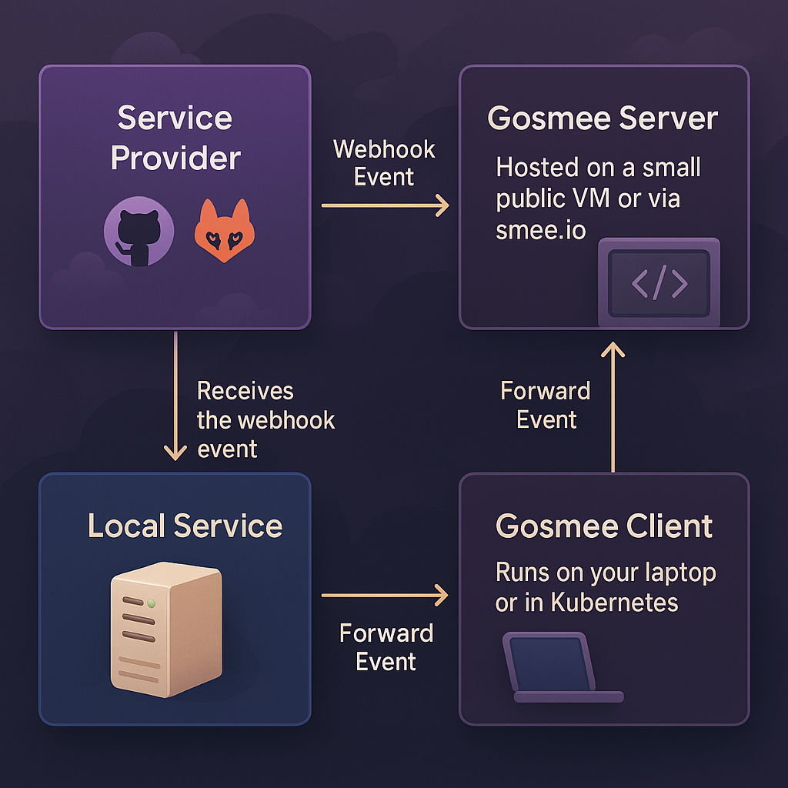
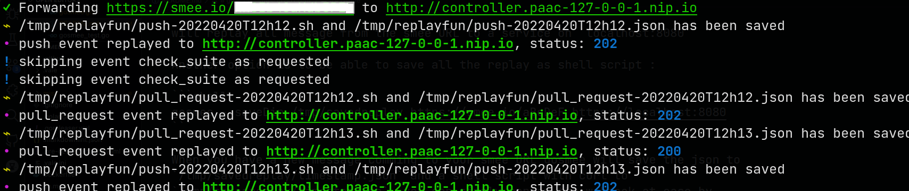

# gosmee - A webhook forwarder/relayer

Gosmee is a webhook relayer that can be easily run anywhere.

## Description

Gosmee enables you to relay webhooks from either itself (as a server) or from <https://smee.io> to your local laptop or an infrastructure that is not publicly available from the internet.

gosmee let you easily expose the service on your local network (like a web service on [localhost](https://en.wikipedia.org/wiki/Localhost)) or behind a VPN, allowing a public service (such as GitHub) push webhooks intoo it.

For instance, if you configure your GitHub Webhook to direct to a <https://smee.io/> URL or where gosmee server is listening, you can then use the gosmee client on your local notebook to obtain the events from the server and forward them to the local service, thereby establishing a connection between the GitHub webhook and your local service on your workstation.

### Diagram

For the people who rather prefer to understand on how it works with a small
diagram:



## Screenshot



## Install

### Release

Go to the [release](https://github.com/chmouel/gosmee/releases) page and choose your archive or package for your platform.

## Homebrew

```shell
brew tap chmouel/gosmee https://github.com/chmouel/gosmee
brew install gosmee
```

## [Arch](https://aur.archlinux.org/packages/gosmee-bin)

```shell
yay -S gosmee-bin
```

### [Docker](https://github.com/users/chmouel/packages/container/package/gosmee)

```shell
docker run ghcr.io/chmouel/gosmee:latest
```

## GO

```shell
go install -v github.com/chmouel/gosmee@latest
```

### Git

Checkout the directory and use :

```shell
-$ make build
-$ ./bin/gosmee --help
```

### [Nix/NixOS](https://nixos.org/)

This repository includes a `flake` (see [NixOS Wiki on
Flakes](https://nixos.wiki/wiki/Flakes)).

If you have the `nix flake` command enabled (currenty on
nixos-unstable, `nixos-version` >= 22.05)

```shell
nix run github:chmouel/gosmee -- --help # your args are here
```


also use it to test and develop the source code:

```shell
nix develop # drops you in a shell with all the thing needed
nix flake check # runs tests
```

### System Services

System Service example file for macOS and Linux is available in the [misc](./misc) directory.

### Shell completion

Shell completion is available with:

```shell
# BASH
source <(gosmee completion bash)

# ZSH
source <(gosmee completion zsh)
```

## Usage

### Client

If you intend to use <https://smee.io>, you might want to generate your own smee URL by visiting <https://smee.io/new>.

Once you have it, the basic usage is as follows:

```shell
gosmee client https://smee.io/aBcDeF https://localhost:8080 
```

This command will relay all payloads received at the smee URL to a service running on <http://localhost:8080>.

Another option is to save all the relays as shell script that can be replayed without having to recreate the event:

```shell
gosmee client --saveDir /tmp/savedreplay https://smee.io/aBcDeF https://localhost:8080
```

This command will save the JSON data of new payloads received at your smee URL to `/tmp/savedreplay/timestamp.json` and create a shell script with cURL options to `/tmp/savedreplay/timestamp.sh`. You can replay the webhook effortlessly by repeatedly running the shell script. 

You can ignore certain events (identified by GitLab/GitHub/Bitbucket) by adding one or more `--ignore-event` flags.

If you only want to save the payloads but not replay them, you can use `--noReplay`.

By default, you will have colored emoji output unless you specify `--nocolor` as an argument.

### Server

With `gosmee server` you can use your own server rather than <https://smee.io>
as relay. By default `gosmee server` will bind to `localhost` on port `3333`
which is not very useful. You probably want to expose it to your public IP or
behind a proxy with the flags `--address` and `--port`.

You really want to secure that endpoint, you can generate some letsencrypt
certificate and use the `--tls-cert` and `--tls-key` flags to specify them.

If you're really lazy (and who isn't) you can just give the flag `--auto-cert` and
it will automatically generate certs. Unfortunately this require to run on
port 443 which need root and very secure. It may be better to just have [caddy](#caddy) installed in front of gosmee.

To use it you go to your URL and a suffix with your random ID. For example:

<https://myserverurl/RANDOM_ID>

The random ID accepted to the server needs to be 12 characters (and you
probably want to be it random).

With `/new` you can easily generate a random ID, ie:

```shell
% curl http://localhost:3333/new
http://localhost:3333/NqybHcEi
```

### Caddy

[Caddy](https://caddyserver.com/) is the best way to run gosmee server, you just need this:

```caddyfile
https://webhook.mydomain {
    reverse_proxy http://127.0.0.1:3333
}
```

It will automatically configure a letsencrypt certificate for you

### Nginx

Running gosmee server behind nginx may require some configuration to work properly.
Here is a `proxy_pass location` to a locally running gosmee server on port localhost:3333:

```nginx
    location / {
        proxy_pass         http://127.0.0.1:3333;
        proxy_set_header Connection '';   
        proxy_http_version 1.1;           
        chunked_transfer_encoding off;    
        proxy_read_timeout 372h; 
    }
```

There is maybe some errors appearing some time with nginx with long running connections.

### Kubernetes

You can expose an internal kubernetes deployment or service with gosmee by using [this file](./misc/kubernetes-deployment.yaml).

Adjust the `SMEE_URL` in there to your endpoint and the `http://deployment.name.namespace.name:PORT_OF_SERVICE` URL is the Kubernetes internal URL of your deployment running on your cluster, for example:

   <http://service.namespace:8080>

## Thanks

- Most of the works is done by the [go-sse](https://github.com/r3labs/sse) library.
- Used previously [pysmee](https://github.com/akrog/pysmee) but it seems that the underlying sse library is broken with chunked transfer.

## Copyright

[Apache-2.0](./LICENSE)

## Authors

### Chmouel Boudjnah

- Fediverse - <[@chmouel@chmouel.com](https://fosstodon.org/@chmouel)>
- Twitter - <[@chmouel](https://twitter.com/chmouel)>
- Blog  - <[https://blog.chmouel.com](https://blog.chmouel.com)>
