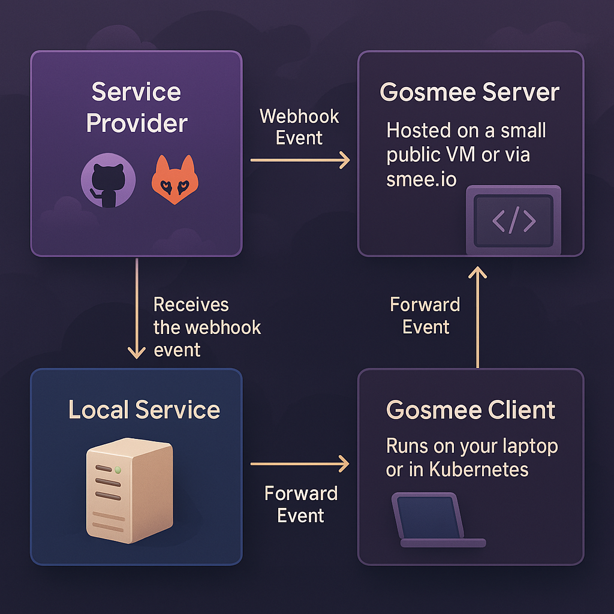
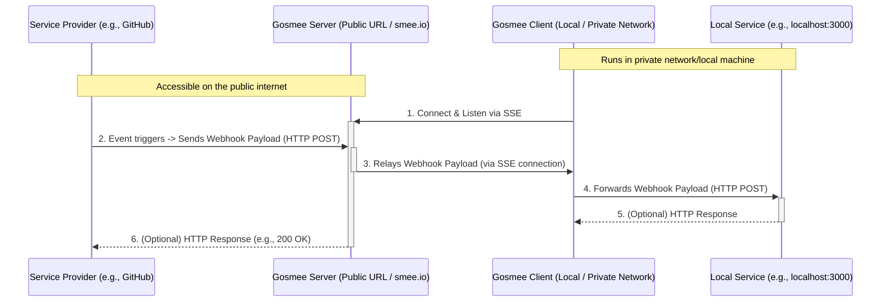
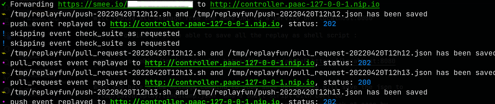

# gosmee - A webhook forwarder, relayer, and replayer


Gosmee is a webhook relayer that runs anywhere with ease. It also serves as a GitHub Hooks replayer using the GitHub API.

## Description

Gosmee enables you to relay webhooks from itself (as a server) or from <https://smee.io> to your local laptop or infrastructure hidden from the public internet.

It makes exposing services on your local network (like localhost) or behind a VPN quite straightforward. This allows public services, such as GitHub, to push webhooks directly to your local environment.

Here's how it works:

1. Configure your webhook to send events to a <https://smee.io/> URL or to your publicly accessible Gosmee server.
2. Run the Gosmee client on your local machine to fetch these events and forward them to your local service.

This creates a proper bridge between GitHub webhooks and your local development environment.

Alternatively, if you'd rather not use a relay server, you can use the GitHub API to replay webhook deliveries directly. (beta)

### Diagram

For those who prefer a visual explanation of how gosmee works:

#### Simple



#### Detailed


```mermaid
sequenceDiagram
    participant SP as Service Provider (e.g., GitHub)
    participant GS as Gosmee Server (Public URL / smee.io)
    participant GC as Gosmee Client (Local / Private Network)
    participant LS as Local Service (e.g., localhost:3000)

    Note over GC, LS: Runs in private network/local machine
    Note over SP, GS: Accessible on the public internet

    GC->>+GS: 1. Connect & Listen via SSE
    SP->>+GS: 2. Event triggers -> Sends Webhook Payload (HTTP POST)
    GS->>-GC: 3. Relays Webhook Payload (via SSE connection)
    GC->>+LS: 4. Forwards Webhook Payload (HTTP POST)
    LS-->>-GC: 5. (Optional) HTTP Response
    GS-->>-SP: 6. (Optional) HTTP Response (e.g., 200 OK)
```

## Blog Post

Learn more about the background and features of this project in this blog post: <https://blog.chmouel.com/posts/gosmee-webhook-forwarder-relayer>

## Screenshot



### Live Event Feed

The web interface of the gosmee server features a live event feed that shows webhook events in real-time:

- Live status indicator showing connection state
- Event counter showing number of received events
- JSON tree viewer for easy payload inspection
- Copy buttons for headers and payloads
- Replay functionality to resend events to your endpoint
- Clear button to remove all events from the feed

Each event in the feed shows:

- Event ID and timestamp
- Headers with copy functionality
- Payload in both tree view and raw JSON formats
- Option to replay individual events

## Installation

### Release

Please visit the [release](https://github.com/chmouel/gosmee/releases) page and choose the appropriate archive or package for your platform.

## Homebrew

```shell
brew tap chmouel/gosmee https://github.com/chmouel/gosmee
brew install gosmee
```

## [Arch](https://aur.archlinux.org/packages/gosmee-bin)

```shell
yay -S gosmee-bin
```

### Docker

#### Gosmee client with Docker

```shell
docker run ghcr.io/chmouel/gosmee:latest
```

#### Gosmee server with Docker

```shell
docker run -d -p 3026:3026 --restart always --name example.org ghcr.io/chmouel/gosmee:latest server --port 3026 --address 0.0.0.0 --public-url https://example.org
```

### GO

```shell
go install -v github.com/chmouel/gosmee@latest
```

### Git

Clone the repository and use:

```shell
-$ make build
-$ ./bin/gosmee --help
```

### [Nix/NixOS](https://nixos.org/)

Gosmee is available from [`nixpkgs`](https://github.com/NixOS/nixpkgs).

```shell
nix-env -iA gosmee
nix run nixpkgs#gosmee -- --help # your args are here
```

### System Services

System service example files for macOS and Linux are available in the [misc](./misc) directory.

### Kubernetes

You can deploy gosmee on Kubernetes to relay webhooks to your internal services.

Two deployment configurations are available:

- [gosmee-server-deployment.yaml](./misc/gosmee-server-deployment.yaml) - For deploying the public-facing server component
- [gosmee-client-deployment.yaml](./misc/gosmee-client-deployment.yaml) - For deploying the client component that forwards to internal services

#### Server Deployment

The server deployment exposes a public webhook endpoint to receive incoming webhook events:

```shell
kubectl apply -f misc/gosmee-server-deployment.yaml
```

Key configuration:

- Set `--public-url` to your actual domain where the service will be exposed
- Configure an Ingress with TLS or use a service mesh for production use
- For security, consider using `--webhook-signature` and `--allowed-ips` options

#### Client Deployment

The client deployment connects to a gosmee server (either your own or smee.io) and forwards webhook events to internal services:

```shell
kubectl apply -f misc/gosmee-client-deployment.yaml
```

Key configuration:

- Adjust the first argument to your gosmee server URL or smee.io channel
- Change the second argument to your internal service URL (e.g., `http://service.namespace:8080`)
- The `--saveDir` flag enables saving webhook payloads to `/tmp/save` for later inspection

For detailed configuration options, please refer to the documentation comments in each deployment file.

### Shell completion

Shell completions are available for gosmee:

```shell
# BASH
source <(gosmee completion bash)

# ZSH
source <(gosmee completion zsh)
```

## Usage

### Client

If you plan to use the <https://smee.io> service, you can generate your own smee URL by visiting <https://smee.io/new>.

If you want to use the <https://hook.pipelinesascode.com> service then you can directly generate a URL with the `-u / --new-url` flag.

Once you have the relay URL, the basic usage is:

```shell
gosmee client https://smee.io/aBcDeF https://localhost:8080
```

This command will relay all payloads received by the smee URL to a service running on <http://localhost:8080>.

You can also save all relays as shell scripts for easy replay:

```shell
gosmee client --saveDir /tmp/savedreplay https://smee.io/aBcDeF https://localhost:8080
```

This command saves the JSON data of new payloads to `/tmp/savedreplay/timestamp.json` and creates shell scripts with cURL options at `/tmp/savedreplay/timestamp.sh`. Replay webhooks easily by running these scripts.

You can configure the SSE client buffer size (in bytes) with the `--sse-buffer-size` flag. The default is `1048576` (1MB).

#### Protected channels

Protected channels are optional and only apply to channel IDs listed in the server's `--encrypted-channels-file`.

Plaintext gosmee channels still work without a key file:

```shell
gosmee client https://myserverurl/plain-channel https://localhost:8080
```

When connecting to a protected channel on your own `gosmee server`, the client must use a pre-generated keypair file. There is no client-side auto-generation during `gosmee client` startup.

Generate a keypair once:

```shell
gosmee keygen --key-file ~/.config/gosmee/client-key.json
```

This writes the private key file and prints the corresponding public key to stdout. Add that public key to the server's protected-channel config.

Then connect with the key file:

```shell
gosmee client --encryption-key-file ~/.config/gosmee/client-key.json https://myserverurl/CHANNEL_ID https://localhost:8080
```

Notes:

- This protected-channel flow only works with gosmee's own SSE endpoint. `https://smee.io` does not use client keys.
- For gosmee channels that are not listed in `--encrypted-channels-file`, `--encryption-key-file` is not needed and payloads stay plaintext.
- Payloads are encrypted from the gosmee server to authorized clients. The gosmee server still sees plaintext when it receives the webhook.
- Saved payloads from `--saveDir` are written after decryption on the client side.

For those who prefer [HTTPie](https://httpie.io) over cURL, you can generate HTTPie-based replay scripts:

```shell
gosmee client --httpie --saveDir /tmp/savedreplay https://smee.io/aBcDeF https://localhost:8080
```

This will create replay scripts that use the `http` command instead of `curl`. The generated scripts support the same features as cURL scripts; the output will be rather nicer and presented in colour.

You can ignore certain events (identified by GitLab/GitHub/Bitbucket) with one or more `--ignore-event` flags.

If you only want to save payloads without replaying them, use `--noReplay`.

By default, you'll get colourful output unless you specify `--nocolor`.

Output logs as JSON with `--output json` (which implies `--nocolor`).

#### Executing commands on webhook events

You can execute a shell command whenever a webhook event is received using `--exec`:

```shell
gosmee client --exec 'jq . $GOSMEE_PAYLOAD_FILE' https://smee.io/aBcDeF http://localhost:8080
```

The payload and headers are written to temporary files (automatically cleaned up after the command finishes). The following environment variables are set:

| Variable | Description |
|---|---|
| `GOSMEE_EVENT_TYPE` | The event type (e.g., `push`, `pull_request`) |
| `GOSMEE_EVENT_ID` | The delivery ID |
| `GOSMEE_CONTENT_TYPE` | The content type of the payload |
| `GOSMEE_TIMESTAMP` | The timestamp of the event |
| `GOSMEE_PAYLOAD_FILE` | Path to a temporary file containing the JSON payload body |
| `GOSMEE_HEADERS_FILE` | Path to a temporary file containing the webhook headers as JSON |

To only run the command for specific event types, use `--exec-on-events`:

```shell
gosmee client --exec './handle-push.sh' --exec-on-events push --exec-on-events pull_request https://smee.io/aBcDeF http://localhost:8080
```

The `--exec` command runs **synchronously** after the webhook is forwarded to the target URL (if replay is enabled). A slow command will delay processing of subsequent events. If you need asynchronous execution, background your command (e.g., `--exec './my-script.sh &'`). A non-zero exit code is logged as an error but does not stop processing further events.

Both `--exec` and `--exec-on-events` also work with the `replay` command.

> **Security Warning**: The `--exec` flag runs arbitrary shell commands with
> the webhook payload available via `$GOSMEE_PAYLOAD_FILE`. When receiving
> webhooks from untrusted sources, a malicious payload could exploit a
> naively written script (e.g., one that passes unsanitized fields to shell
> commands). Always validate and sanitize webhook payloads in your exec
> scripts. Consider using `--webhook-signature` on the server side to verify
> webhook authenticity.

#### Replay scripts

Both cURL and HTTPie replay scripts include these command-line options:

- `-l, --local`: Use local debug URL
- `-t, --target URL`: Specify target URL directly
- `-h, --help`: Show help message
- `-v, --verbose`: Enable verbose output

**Examples:**

```shell
# Use local debug endpoint
./timestamp.sh -l

# Specify custom target URL
./timestamp.sh -t http://custom-service:8080

# Use verbose mode for debugging
./timestamp.sh -v

# Show help
./timestamp.sh -h
```

Scripts also respect the `GOSMEE_DEBUG_SERVICE` environment variable for alternative target URLs.

### Server

With `gosmee server` you can run your own relay server instead of using <https://smee.io>.

By default, `gosmee server` binds to `localhost` on port `3333`. For practical use, you'll want to expose it to your public IP or behind a proxy using the `--address` and `--port` flags.

For security, you can use Let's Encrypt certificates with the `--tls-cert` and `--tls-key` flags.

There are many flags available - check them with `gosmee server --help`.

To use your server in normal plaintext mode, access it with a URL format like:

<https://myserverurl/RANDOM_ID>

The random ID must be 12 characters long with characters from `a-zA-Z0-9_-`.

Generate a random ID easily with the `/new` endpoint:

```shell
% curl http://localhost:3333/new
http://localhost:3333/NqybHcEi
```

#### Protected client channels

If you want specific channels to be key-protected, provide `--encrypted-channels-file`. Only the channels listed in that file require authorized client keys and encrypted SSE delivery. All other gosmee channels continue to work in legacy plaintext mode.

Example protected-channel config:

```json
{
  "channels": {
    "customer-a-channel": {
      "allowed_public_keys": [
        "CLIENT_PUBLIC_KEY_1",
        "CLIENT_PUBLIC_KEY_2"
      ]
    }
  }
}
```

Start the server with that config:

```shell
gosmee server --encrypted-channels-file /etc/gosmee/channels.json --public-url https://myserverurl
```

For a protected channel, configure the webhook to post to:

<https://myserverurl/customer-a-channel>

Important:

- Only channels listed in `--encrypted-channels-file` are protected.
- A protected channel only delivers to clients whose public key is listed for that channel.
- Unauthorized subscribers to a protected channel receive a generic not-found response.
- The built-in browser UI and `/new` remain available for plaintext channels, but protected channels are not exposed through the browser UI.

#### Caddy

[Caddy](https://caddyserver.com/) is rather ideal for running gosmee server:

```caddyfile
https://webhook.mydomain {
    reverse_proxy http://127.0.0.1:3333 {
        header_up X-Real-IP {remote_host}
        header_up X-Forwarded-For {remote_host}
    }
}
```

It automatically configures Let's Encrypt certificates for you.

#### Nginx

Running gosmee server behind nginx requires some configuration:

```nginx
    location / {
        proxy_pass         http://127.0.0.1:3333;
        proxy_set_header Connection '';
        proxy_set_header X-Real-IP $remote_addr;
        proxy_set_header X-Forwarded-For $proxy_add_x_forwarded_for;
        proxy_http_version 1.1;
        chunked_transfer_encoding off;
        proxy_read_timeout 372h;
    }
```

Note: Long-running connections may occasionally cause errors with nginx. Contributions to debug this are most welcome.

#### Security

For a full security reference — including webhook signature validation, IP restrictions, payload limits, channel name protection, and encrypted channels — see [SECURITY.md](./SECURITY.md).

## Replay Webhook Deliveries via the GitHub API (beta)

If you'd rather not use a relay server with GitHub, you can replay webhook deliveries directly via the GitHub API.

This method is more reliable as you don't depend on relay server availability. You'll need a GitHub token with appropriate scopes:

- For repository webhooks: `read:repo_hook` or `repo` scope
- For organisation webhooks: `admin:org_hook` scope

Currently supports replaying webhooks from Repositories and Organisations (GitHub Apps webhooks not supported).

First, find the Hook ID:

```shell
gosmee replay --github-token=$GITHUB_TOKEN --list-hooks org/repo
```

List hooks for an organisation:

```shell
gosmee replay --github-token=$GITHUB_TOKEN --list-hooks org
```

Start listening and replaying events on a local server:

```shell
gosmee replay --github-token=$GITHUB_TOKEN org/repo HOOK_ID http://localhost:8080
```

This will listen to all **new** events and replay them to <http://localhost:8080>.

Replay all events received since a specific time (UTC format `2023-12-19T12:31:12`):

```shell
gosmee replay --time-since=2023-12-19T09:00:00 --github-token=$GITHUB_TOKEN org/repo HOOK_ID http://localhost:8080
```

To find the right date, list all deliveries:

```shell
gosmee replay --github-token=$GITHUB_TOKEN --list-deliveries org/repo HOOK_ID
```

>[!NOTE]
>`gosmee replay` doesn't support paging yet and lists only the last 100 deliveries. Specifying a date older than the last 100 deliveries won't work.
>
>When rate limited, gosmee will fail without recovery mechanisms.

## Replay Viewer Utility

<https://github.com/user-attachments/assets/dbd0978a-a8ef-4e77-b498-672497567b39>

Gosmee includes a helper script [`misc/replayview`](./misc/replayview) for interactively browsing, previewing, and replaying webhook events saved by the client (`--saveDir`). This tool lets you:

- Fuzzy-find replay shell scripts and their JSON payloads
- Preview event metadata, headers, and payloads
- Copy replay script paths to clipboard
- Create symlinks for quick access
- Run replay scripts directly
- Interactively inspect JSON payloads (requires [`fx`](https://github.com/antonmedv/fx))

**Usage:**

```sh
./misc/replayview -h
```

By default, it looks for replay files in `/tmp/save` or `/tmp/replay`. Use `-d <dir>` to specify a different directory.

It will create a symbolic link of the chosen replay event to the file `/tmp/run.sh`, which redirects the event to the local service for easy payload replay.

**Requirements:** `fzf`, `jq`, `fd`, and optionally [fx](https://fx.wtf/) for interactive JSON viewing.

See the script header or run with `-h` for full options and details.

## Beyond Webhook

Gosmee is webhook-specific. For other tunnelling solutions, check <https://github.com/anderspitman/awesome-tunneling>. Recommended alternatives include [go-http-tunnel](https://github.com/mmatczuk/go-http-tunnel) or [tailscale](https://tailscale.com/).

## Caveats

This tool is intended for local development and testing environments only. It hasn't undergone thorough security and performance reviews and should not be deployed in production systems.

[smee-sidecar](https://github.com/konflux-ci/smee-sidecar) is a service intended for monitoring gosmee deployments. It provides active health checks to verify that gosmee is serving requests.

## Thanks

- Most of the work is powered by the [go-sse](https://github.com/r3labs/sse) library.
- I previously used [pysmee](https://github.com/akrog/pysmee) but its underlying SSE library had issues with chunked transfers, that leads me to rewrite it in Go and add some specific features needed for my use cases.

## Copyright

[Apache-2.0](./LICENSE)

## Authors

### Chmouel Boudjnah

- Fediverse - <[@chmouel@chmouel.com](https://fosstodon.org/@chmouel)>
- Twitter - <[@chmouel](https://twitter.com/chmouel)>
- Blog  - <[https://blog.chmouel.com](https://blog.chmouel.com)>
