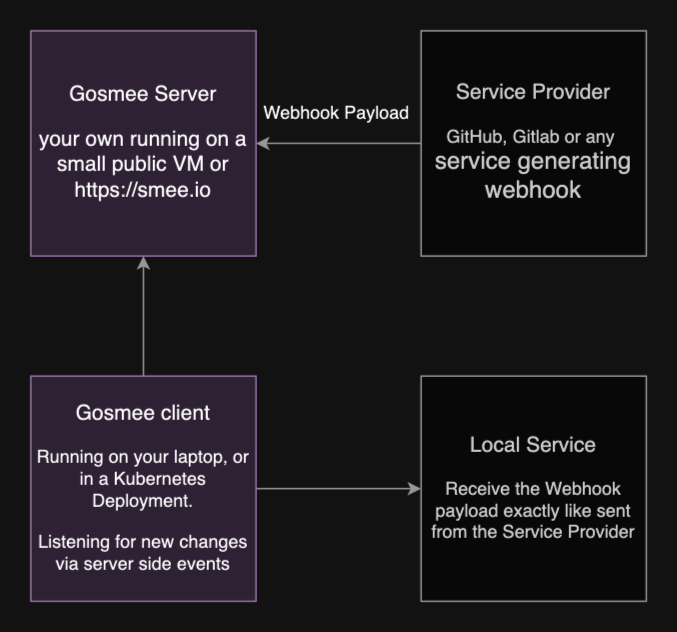

# 🔄 gosmee - A webhook forwarder/relayer and replayer

<p align="center">

</p>

✨ Gosmee is a powerful webhook relayer that runs anywhere with ease!
📡 It also serves as a GitHub Hooks replayer using the GitHub API.

## 📝 Description

🌉 Gosmee enables you to relay webhooks from itself (as a server) or from
<https://smee.io> to your local laptop or infrastructure hidden from the public
internet.

🔌 It makes exposing services on your local network (like localhost) or behind
a VPN super simple! This allows public services, such as GitHub, to push
webhooks directly to your local environment.

Here's how it works:

1. 🎯 Configure your Webhook to send events to a <https://smee.io/> URL or to
   your publicly accessible Gosmee server.
2. 🚀 Run the Gosmee client on your local machine to fetch these events and
   forward them to your local service.

This creates a seamless bridge between GitHub webhooks and your local
development environment!

🔄 Alternatively, if you prefer not to use a relay server, you can use the
GitHub API to replay webhook deliveries.

### 📊 Diagram

For those who prefer a visual explanation of how gosmee works:

#### Simple



#### Detailed


## 📰 Blog Post

✍️ Learn more about the background and features of this project in this blog
post: <https://blog.chmouel.com/posts/gosmee-webhook-forwarder-relayer>

## 🖼️ Screenshot


### 🌐 Live Event Feed

The web interface of the gosmee server features a live event feed that shows webhook events in real-time:

- 🔴 Live status indicator showing connection state
- 📊 Event counter showing number of received events
- 🔍 JSON tree viewer for easy payload inspection
- 📋 Copy buttons for headers and payloads
- 🔄 Replay functionality to resend events to your endpoint
- 🧹 Clear button to remove all events from the feed

Each event in the feed shows:

- Event ID and timestamp
- Headers with copy functionality
- Payload in both tree view and raw JSON formats
- Option to replay individual events

## 📥 Install

### 📦 Release

🔽 Go to the [release](https://github.com/chmouel/gosmee/releases) page and
choose the appropriate archive or package for your platform.

## 🍺 Homebrew

```shell
brew tap chmouel/gosmee https://github.com/chmouel/gosmee
brew install gosmee
```

## 🏹 [Arch](https://aur.archlinux.org/packages/gosmee-bin)

```shell
yay -S gosmee-bin
```

### 🐳 [Docker](https://github.com/users/chmouel/packages/container/package/gosmee)

#### Gosmee client with Docker

```shell
docker run ghcr.io/chmouel/gosmee:latest
```

#### Gosmee server with Docker

```shell
docker run -d -p 3026:3026 --restart always --name example.org ghcr.io/chmouel/gosmee:latest server --port 3026 --address 0.0.0.0 --public-url https://example.org
```

### 🔧 GO

```shell
go install -v github.com/chmouel/gosmee@latest
```

### 📂 Git

Clone the repository and use:

```shell
-$ make build
-$ ./bin/gosmee --help
```

### ❄️ [Nix/NixOS](https://nixos.org/)

Gosmee is available from [`nixpkgs`](https://github.com/NixOS/nixpkgs).

```shell
nix-env -iA gosmee
nix run nixpkgs#gosmee -- --help # your args are here
```

### ⚙️ System Services

System Service example files for macOS and Linux are available in the
[misc](./misc) directory.

### ☸️ Kubernetes

You can expose an internal kubernetes deployment or service with gosmee by
using [this file](./misc/kubernetes-deployment.yaml).

Adjust the `SMEE_URL` to your endpoint and the
`http://deployment.name.namespace.name:PORT_OF_SERVICE` URL is the Kubernetes
internal URL of your deployment running on your cluster, for example:

   <http://service.namespace:8080>

### 🔤 Shell completion

Shell completions are available for gosmee:

```shell
# BASH
source <(gosmee completion bash)

# ZSH
source <(gosmee completion zsh)
```

## 🚀 Usage

### 💻 Client

If you plan to use <https://smee.io>, you can generate your own smee URL by
visiting <https://smee.io/new>.

Once you have it, the basic usage is:

```shell
gosmee client https://smee.io/aBcDeF https://localhost:8080
```

This command will relay all payloads received at the smee URL to a service
running on <http://localhost:8080>.

✨ You can also save all relays as shell scripts for easy replay:

```shell
gosmee client --saveDir /tmp/savedreplay https://smee.io/aBcDeF https://localhost:8080
```

This command saves the JSON data of new payloads to
`/tmp/savedreplay/timestamp.json` and creates shell scripts with cURL options
at `/tmp/savedreplay/timestamp.sh`. Replay webhooks easily by running these
scripts!

🙈 You can ignore certain events (identified by GitLab/GitHub/Bitbucket) with one or more `--ignore-event` flags.

If you only want to save payloads without replaying them, use `--noReplay`.

🎨 By default, you'll get colorful emoji output unless you specify `--nocolor`.

📊 Output logs as JSON with `--output json` (which implies `--nocolor`).

### 🖥️ Server

With `gosmee server` you can run your own relay server instead of using
<https://smee.io>.

By default, `gosmee server` binds to `localhost` on port `3333`. For practical
use, you'll want to expose it to your public IP or behind a proxy using the
`--address` and `--port` flags.

🔒 For security, you can use Let's Encrypt certificates with the `--tls-cert`
and `--tls-key` flags.

There are many customization options available - check them with `gosmee server
--help`.

To use your server, access it with a URL format like:

<https://myserverurl/RANDOM_ID>

The random ID must be 12 characters long with characters from `a-zA-Z0-9_-`.

🆕 Generate a random ID easily with the `/new` endpoint:

```shell
% curl http://localhost:3333/new
http://localhost:3333/NqybHcEi
```

#### 🟢 Caddy

[Caddy](https://caddyserver.com/) is the ideal way to run gosmee server:

```caddyfile
https://webhook.mydomain {
    reverse_proxy http://127.0.0.1:3333
}
```

It automatically configures Let's Encrypt certificates for you!

#### 🔵 Nginx

Running gosmee server behind nginx requires some configuration:

```nginx
    location / {
        proxy_pass         http://127.0.0.1:3333;
        proxy_set_header Connection '';
        proxy_http_version 1.1;
        chunked_transfer_encoding off;
        proxy_read_timeout 372h;
    }
```

⚠️ Long-running connections may occasionally cause errors with nginx.
Contributions to debug this are welcome!

#### 🛡️ Security

##### 📦 Payload Size Protection

To protect server resources and match GitHub's standards, gosmee enforces a 25 MB payload size limit. Any request exceeding this limit will receive a 413 Request Entity Too Large response.

🔗 See GitHub's documentation: <https://docs.github.com/en/webhooks/webhook-events-and-payloads#payload-cap>

##### 🔒 Channel Name Protection

To prevent potential DoS attacks and ensure system stability:

- 📏 Channel names are limited to 64 characters maximum
- 🛣️ All route handlers (`/`, `/events/{channel}`, `/replay/{channel}`, POST `/{channel}`) enforce this limit
- ✅ Built-in validation for all endpoints that handle channel names
- 🛡️ Protects against resource exhaustion attacks that could be caused by excessive channel name lengths

## 🔁 Replay webhook deliveries via the GitHub API (beta)

🔄 If you prefer not to use a relay server with GitHub, you can replay webhook deliveries directly via the GitHub API.

This method is more reliable as you don't depend on relay server availability.
You'll need a GitHub token with appropriate scopes:

- For repository webhooks: `read:repo_hook` or `repo` scope
- For organization webhooks: `admin:org_hook` scope

Currently supports replaying webhooks from Repositories and Organizations (GitHub Apps webhooks not supported).

First, find the Hook ID:

```shell
gosmee replay --github-token=$GITHUB_TOKEN --list-hooks org/repo
```

List hooks for an organization:

```shell
gosmee replay --github-token=$GITHUB_TOKEN --list-hooks org
```

Start listening and replaying events on a local server:

```shell
gosmee replay --github-token=$GITHUB_TOKEN org/repo HOOK_ID http://localhost:8080
```

This will listen to all **new** events and replay them to <http://localhost:8080>.

⏱️ Replay all events received since a specific time (UTC format `2023-12-19T12:31:12`):

```shell
gosmee replay --time-since=2023-12-19T09:00:00 --github-token=$GITHUB_TOKEN org/repo HOOK_ID http://localhost:8080
```

To find the right date, list all deliveries:

```shell
gosmee replay --github-token=$GITHUB_TOKEN --list-deliveries org/repo HOOK_ID
```

>[!NOTE]
>`gosmee replay` doesn't support paging yet and lists only the last
>100 deliveries. Specifying a date older than the last 100
>deliveries won't work.
>
>When rate limited, gosmee will fail without recovery mechanisms.

## 🔄 Beyond Webhook

Gosmee is webhook-specific. For other tunneling solutions, check
<https://github.com/anderspitman/awesome-tunneling>. Recommended alternatives
include [go-http-tunnel](https://github.com/mmatczuk/go-http-tunnel) or
[tailscale](https://tailscale.com/).

## ⚠️ Caveats ⚠️

⚠️ This tool is intended for local development and testing environments only!
It hasn't undergone thorough security and performance reviews and
should not be deployed in production systems.

## 🙏 Thanks

- Most of the work is powered by the [go-sse](https://github.com/r3labs/sse) library.
- Previously used [pysmee](https://github.com/akrog/pysmee) but its underlying
SSE library had issues with chunked transfers.

## 📜 Copyright

[Apache-2.0](./LICENSE)

## 👥 Authors

### 👨‍💻 Chmouel Boudjnah

- 🐘 Fediverse - <[@chmouel@chmouel.com](https://fosstodon.org/@chmouel)>
- 🐦 Twitter - <[@chmouel](https://twitter.com/chmouel)>
- 📝 Blog  - <[https://blog.chmouel.com](https://blog.chmouel.com)>
