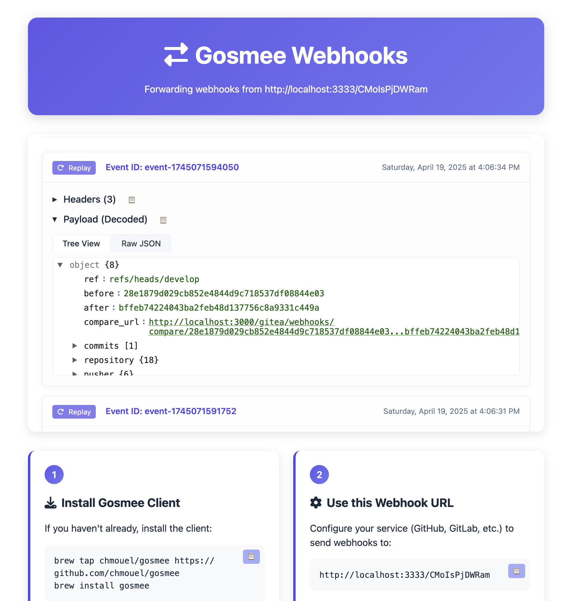

# gosmee - A webhook forwarder/relayer and replayer

<p align="center">

</p>

Gosmee is a webhook relayer that can be easily run anywhere.
It can act as well as a replayer using the GitHub API for GitHub Hooks.n

## Description

Gosmee enables you to relay webhooks from either itself (as a server) or from <https://smee.io> to your local laptop or an infrastructure that is not accessible from the public internet.

Gosmee makes it easy to expose a service on your local network (such as a web service on localhost) or behind a VPN. This enables a public service, like GitHub, to push webhooks to your local environment.

Here's how it works:

1. Configure your Webhook to direct events to a https://smee.io/ URL or to a URL where your Gosmee server is publicly listening acting as a relay server.
2. Use the Gosmee client on your local machine to retrieve these events from the relay server and forward them to your local service.

This setup creates a bridge between the GitHub webhook and your local service on your workstation.

Alternatively, if you prefer not to use a relay server, you can use the GitHub API to [replay the webhook](#replay-webhook-deliveries-via-the-github-api) deliveries directly.

### Diagram

For the people who rather prefer to understand on how it works with a small
diagram:


## Blog Post

There is a blog post as well that explains it the background of this project and some of its features: <https://blog.chmouel.com/posts/gosmee-webhook-forwarder-relayer>

## Screenshot



## Install

### Release

Go to the [release](https://github.com/chmouel/gosmee/releases) page and choose your archive or package for your platform.

## Homebrew

```shell
brew tap chmouel/gosmee https://github.com/chmouel/gosmee
brew install gosmee
```

## [Arch](https://aur.archlinux.org/packages/gosmee-bin)

```shell
yay -S gosmee-bin
```

### [Docker](https://github.com/users/chmouel/packages/container/package/gosmee)

#### Gosmee client with Docker

```shell
docker run ghcr.io/chmouel/gosmee:latest
```

#### Gosmee server with Docker

```shell
docker run -d -p 3026:3026 --restart always --name example.org ghcr.io/chmouel/gosmee:latest server --port 3026 --address 0.0.0.0 --public-url https://example.org
```

### GO

```shell
go install -v github.com/chmouel/gosmee@latest
```

### Git

Checkout the directory and use :

```shell
-$ make build
-$ ./bin/gosmee --help
```

### [Nix/NixOS](https://nixos.org/)

Gosmee is available from [`nixpkgs`](https://github.com/NixOS/nixpkgs).

```shell
nix-env -iA gosmee
nix run nixpkgs#gosmee -- --help # your args are here
```

### System Services

System Service example file for macOS and Linux is available in the [misc](./misc) directory.

### Kubernetes

You can expose an internal kubernetes deployment or service with gosmee by using [this file](./misc/kubernetes-deployment.yaml).

Adjust the `SMEE_URL` in there to your endpoint and the `http://deployment.name.namespace.name:PORT_OF_SERVICE` URL is the Kubernetes internal URL of your deployment running on your cluster, for example:

   <http://service.namespace:8080>

### Shell completion

Shell completions is available for gosmee:

```shell
# BASH
source <(gosmee completion bash)

# ZSH
source <(gosmee completion zsh)
```

## Usage

### Client

If you intend to use <https://smee.io>, you might want to generate your own smee URL by visiting <https://smee.io/new>.

Once you have it, the basic usage is as follows:

```shell
gosmee client https://smee.io/aBcDeF https://localhost:8080
```

This command will relay all payloads received at the smee URL to a service running on <http://localhost:8080>.

Another option is to save all the relays as shell script that can be replayed without having to recreate the event:

```shell
gosmee client --saveDir /tmp/savedreplay https://smee.io/aBcDeF https://localhost:8080
```

This command will save the JSON data of new payloads received at your smee URL to `/tmp/savedreplay/timestamp.json` and create a shell script with cURL options to `/tmp/savedreplay/timestamp.sh`. You can replay the webhook effortlessly by repeatedly running the shell script.

You can ignore certain events (identified by GitLab/GitHub/Bitbucket) by adding one or more `--ignore-event` flags.

If you only want to save the payloads but not replay them, you can use `--noReplay`.

By default, you will have colored emoji output unless you specify `--nocolor` as an argument.

You can output the logs as json with the `--output json` which imply `--nocolor`

### Server

With `gosmee server` you can use your own server rather than <https://smee.io>
as relay. By default `gosmee server` will bind to `localhost` on port `3333`
which is not very useful. You probably want to expose it to your public IP or
behind a proxy with the flags `--address` and `--port`.

You really want to secure that endpoint, you can generate some letsencrypt
certificate and use the `--tls-cert` and `--tls-key` flags to specify them.

There is a lot of other flags you can use to customize the server, you can see them with `gosmee server --help`.

To use it you go to your URL and a suffix with your random ID. For example:

<https://myserverurl/RANDOM_ID>

The random ID accepted to the server needs to be 12 characters (and you
probably want to be it random).

With `/new` you can easily generate a random ID, ie:

```shell
% curl http://localhost:3333/new
http://localhost:3333/NqybHcEi
```

#### Caddy

[Caddy](https://caddyserver.com/) is the best way to run gosmee server, you just need this:

```caddyfile
https://webhook.mydomain {
    reverse_proxy http://127.0.0.1:3333
}
```

It will automatically configure a letsencrypt certificate for you

#### Nginx

Running gosmee server behind nginx may require some configuration to work properly.
Here is a `proxy_pass location` to a locally running gosmee server on port localhost:3333:

```nginx
    location / {
        proxy_pass         http://127.0.0.1:3333;
        proxy_set_header Connection '';
        proxy_http_version 1.1;
        chunked_transfer_encoding off;
        proxy_read_timeout 372h;
    }
```

There is maybe some errors appearing some time with nginx with long running connections. Help is welcome to help debug this.

## Replay webhook deliveries via the GitHub API

Alternatively if you don't want to use a relay server and use GitHub you can
replay the hooks deliveries via the GitHub API. Compared to the relay server
method this is more reliable and you don't have to worry about the relay server
being down. The downside is that it only works with GitHub and you need to have
a GitHub token. The scopes needed are:

- For repository webhooks, the token must have the `read:repo_hook` or `repo` scope
- For organizations webhooks, you must have the `admin:org_hook` scope.

It currently only supports replaying webhook installed on Repositories and
Organizations but not supporting webhooks events from GitHub apps.

You will need to know the Hook ID of the webhook you want to replay, you can
get it with the `--hook-id` command:

```shell
goplay replay --github-token=$GITHUB_TOKEN --list-hooks org/repo
```

This will list all the hooks for the repository and their ID.

If you want to list the hooks on an organization you can just specify the org
name with no slash (same goes for the rest of this documentation, it behaves the
same between org and repo):

```shell
goplay replay --github-token=$GITHUB_TOKEN --list-hooks org
```

When you grab the appropriate you can start to listen to the events and replay them on a local
server:

```shell
goplay replay --github-token=$GITHUB_TOKEN org/repo HOOK_ID http://localhost:8080
```

This will listen to all **new** events and replay them on <http://localhost:8080>.

You can also replay all the events that have been previously received by the
hook from a date time. The date is is in UTC and in the format of
`2023-12-19T12:31:12` and it will replay all the events from that date to now:

```shell
goplay replay --time-since=2023-12-19T09:00:00 --github-token=$GITHUB_TOKEN org/repo HOOK_ID http://localhost:8080
```

To make it easier to know the date you can use the `--list-deliveries` command
to list all the deliveries and their date:

```shell
goplay replay --github-token=$GITHUB_TOKEN --list-deliveries org/repo HOOK_ID
```

>[!NOTE]
>`gosmee replay` does not support paging yet, and list only the last
>100 deliveries. So if you specify a date that is older than the last 100
>deliveries it will not work.
>
>When the token gets rate limited, gosmee will be just failing and do not at the
>moment do anything to recover from this.

## Beyond Webhook

gosmee will only works with webhooks, if you want an alternative solution you can try to looks the one you like from this list https://github.com/anderspitman/awesome-tunneling, my favourite would be [go-http-tunnel](https://github.com/mmatczuk/go-http-tunnel) or [tailscale](https://tailscale.com/).

## Thanks

- Most of the works is done by the [go-sse](https://github.com/r3labs/sse) library.
- Used previously [pysmee](https://github.com/akrog/pysmee) but it seems that the underlying sse library is broken with chunked transfer.

## Copyright

[Apache-2.0](./LICENSE)

## Authors

### Chmouel Boudjnah

- Fediverse - <[@chmouel@chmouel.com](https://fosstodon.org/@chmouel)>
- Twitter - <[@chmouel](https://twitter.com/chmouel)>
- Blog  - <[https://blog.chmouel.com](https://blog.chmouel.com)>
